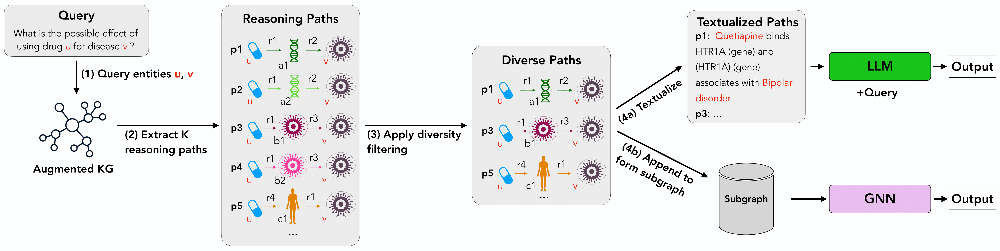

## K-Paths: Reasoning over Graph Paths for Drug Repurposing and Drug Interaction Prediction.
K-Paths is a retrieval framework that extracts structured, diverse, and biologically meaningful paths from knowledge graphs (KGs). These extracted paths enables large language models (LLMs) and graph neural networks (GNNs) to predict unobserved drug-drug and drug-disease interactions more effectively.
Beyond its scalability and efficiency, K-Paths uniquely bridges the gap between KGs and LLMs, providing explainable rationales for predictions.

K-Paths Overview: (1) Given a query about the effect of an entity ($u$) on another entity ($v$), (2) K-Paths extracts reasoning paths from an augmented Knowledge graph. (3) These paths are filtered for diversity and (4a) transformed into natural language descriptions for LLM inference. (4b) The retrieved paths can also be used to build a subgraph for GNN-based predictions.

[📖 Paper](https://arxiv.org/abs/2502.13344) | [🤗 Hugging Face Dataset](https://huggingface.co/Tassy24)

---
# News 🎉
- K-Paths has been accepted as a conference paper at KDD 2025, Toronto, Canada.
- The repo is currently under active development — stay tuned for new features!

---
## Features
- Extract multi-hop reasoning paths between entity pairs from a knowledge graph.
- Generate subgraphs via pruning, suitable for downstream GNN training.
- Supports zero-shot LLM inference and automatic evaluation (exact-match using regex & BERTScore).

---
## Coming Soon
- Custom Augmented Networks: Generate and modify augmented knowledge graphs by combining Hetionet with your own training data.
- LLM Fine-Tuning: Add support to fine-tune large language models using path-based data.
- GNN Training & Inference: Add support for fine-tuning and running GNN models on the extracted subgraphs.

---
## Dataset support:
- Drugbank (Drug–drug interaction type classification),
- PharmacotherapyDB (Drug repurposing), 
- DDinter (Drug–drug interaction severity classification)

## Usage
- Requires Python 3.10+
- Install dependenicies (pip -r requirements.txt)

## Step by Step workflow:
- To use the multihop paths directly for inference, download via [🤗 Hugging Face Dataset](https://huggingface.co/Tassy24)

- To reproduce fro scratch
### Step 1: Download the data
Download the dataset bundle from:  
[📦 data.zip (Google Drive)](https://drive.google.com/file/d/1_6meo_nB2RqHrVM9pqCBA67FQ6PR4QiI/view?usp=drive_link)

### Step 2: Create Augmented network for the supported datasets:
 example: python k-paths/src/create_augmented_network.py

### Step 3 : Extract K reasoning paths: example: 
python k-paths/src/get-Kpaths.py \
  --dataset ddinter \
  --split test \
  --mode K-paths \
  --add_reverse_edges

### Step 4: Create subgraphs for GNN input:
example: python k-paths/src/get-subgraph.py

